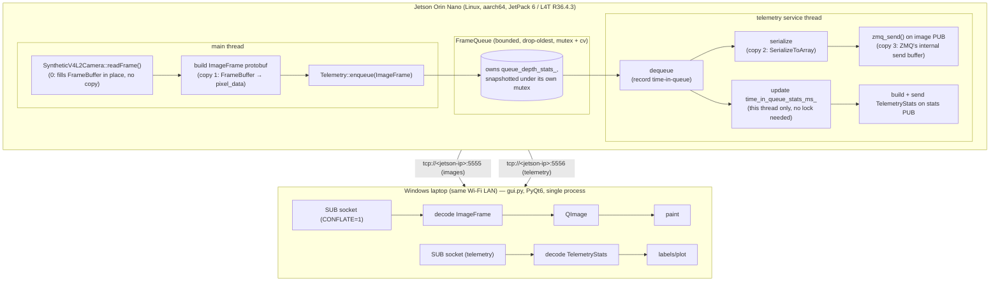

# Design — V4L2 / Protobuf / ZeroMQ Telemetry Demo

> Implements [requirements.md](requirements.md). Read that first — this doc makes the concrete
> engineering choices needed to build it.

## 1. Component / Process Map



Two threads on the producer, two independent ZMQ `PUB` sockets, one Python process on the GUI
side with a Qt event loop driven by a background receive thread (details in §6).

## 2. Toolchain & Dependencies

| Component | Choice | Notes |
|---|---|---|
| Jetson OS | JetPack 6 / L4T R36.4.3, Ubuntu 22.04, aarch64 | native build on-device, no cross-compile |
| C++ standard | C++17 | sufficient for the class design below; avoids C++20 toolchain risk on JetPack's default GCC |
| Build system | CMake ≥ 3.16 | Ubuntu 22.04's packaged CMake is new enough |
| Protobuf | `libprotobuf-dev` / `protobuf-compiler` from apt (protobuf 3.x as shipped by Ubuntu 22.04) | pin exact version in `README` once installed; avoid building protobuf from source unless the apt version proves incompatible |
| ZeroMQ | `libzmq3-dev` + `cppzmq` (header-only C++ binding) | `cppzmq` vendored as a submodule or fetched via CMake `FetchContent` — not always packaged |
| Python | 3.10+ (Windows) | matches what recent PyQt6/pyzmq wheels target |
| GUI framework | PyQt6 | per requirements §6.12 |
| Python ZMQ binding | `pyzmq` | standard |
| Python protobuf | `protobuf` (Python package), generated `_pb2.py` from the same `.proto` | version must match the `protoc` used to generate it |

The `.proto` files are the single source of truth for the wire format (requirements §4) and live
in a top-level `proto/` directory shared by both codebases; each side generates its own bindings
from it at build time (C++ via CMake's `protobuf_generate`, Python via `protoc --python_out`).

## 3. Protobuf Schemas

`proto/telemetry.proto`:

```protobuf
syntax = "proto3";
package telemetry;

enum PixelFormat {
  PIXEL_FORMAT_UNSPECIFIED = 0;
  PIXEL_FORMAT_YUY2 = 1; // packed YUV 4:2:2, V4L2 fourcc 'YUYV'
}

message ImageFrame {
  int64  capture_time_unix_ns = 1;  // Jetson clock, time the frame was captured
  uint32 width = 2;                 // 800
  uint32 height = 3;                // 600
  PixelFormat pixel_format = 4;     // PIXEL_FORMAT_YUY2
  bytes pixel_data = 5;             // width*height*2 bytes for YUY2
}

message QueueStats {
  uint32 current_depth = 1;
  uint32 min_depth = 2;
  uint32 max_depth = 3;
  double mean_depth = 4;
}

message TimeInQueueStats {
  double min_ms = 1;
  double max_ms = 2;
  double mean_ms = 3;
}

message TelemetryStats {
  int64 sample_time_unix_ns = 1;
  QueueStats queue_depth = 2;
  TimeInQueueStats time_in_queue = 3;
  uint32 memory_copies_per_frame = 4;
  double cpu_user_seconds_total = 5;   // cumulative, from getrusage()
  double cpu_system_seconds_total = 6; // cumulative, from getrusage()
  int64  max_rss_kb = 7;               // from getrusage()
  double producer_microseconds_per_frame = 8; // most recent frame's main-thread build+enqueue time
                                               // (see design.md §5.2 for exact scope)
}
```

Notes:

- `capture_time_unix_ns` is the field the GUI uses for latency (requirements §6.11) — the GUI
  never inspects pixel content to derive time.
- `pixel_data` carries the full YUY2 buffer (no compression) — consistent with the goal of
  measuring raw copy/transport cost, not codec performance.
- All telemetry stats are cumulative/running over the life of the process (requirements §6.3),
  not windowed.

## 4. Synthetic V4L2 Camera (`SyntheticV4L2Camera`)

```cpp
class SyntheticV4L2Camera {
 public:
  SyntheticV4L2Camera(int width, int height, int fps);
  void open();
  // Blocks until the next frame's target capture time, then fills `out` in place
  // and returns the capture timestamp. No allocation on the steady-state path.
  int64_t readFrame(FrameBuffer& out);
  void close();

 private:
  void renderClockText(FrameBuffer& out, int64_t timestamp_ms);
  int width_, height_, fps_;
  int64_t next_frame_time_ns_;
};
```

- `FrameBuffer` is a pre-allocated, reusable `std::vector<uint8_t>` sized `width*height*2`
  (YUY2), owned by the caller and passed by reference — the camera never allocates per frame.
- Frame pacing: `readFrame` computes the next scheduled capture instant (`next_frame_time_ns_ +=
  1e9/fps`) and sleeps until then (`clock_nanosleep` with `CLOCK_MONOTONIC`), so output is
  paced at 30 fps rather than free-running.
- Text rendering: a minimal built-in bitmap font (8x13 or similar fixed-width glyphs) stamps the
  millisecond-since-epoch string into the Y-plane bytes of the YUY2 buffer; U/V bytes are memset
  to 128 once at buffer creation and never touched again (they don't change frame to frame).
- This class has no V4L2 kernel dependency — it's a plain C++ class, per requirements §3.1.
  Phase 2 would replace this implementation behind the same interface with real
  `ioctl(VIDIOC_*)` calls against `/dev/videoN`.

## 5. Producer Main & Telemetry Object

### 5.1 `main.cpp` capture loop (main thread)

```cpp
SyntheticV4L2Camera camera(800, 600, 30);
Telemetry telemetry(/*queue_capacity=*/30, image_endpoint, stats_endpoint);
camera.open();
telemetry.start();

FrameBuffer buf(800 * 600 * 2);
while (running) {
  int64_t capture_ns = camera.readFrame(buf);              // (1) camera fills buf in place
  auto t0 = steady_clock::now();                           // timing starts *after* the camera's
                                                             // pacing wait — see §5.2

  auto pb_frame = std::make_unique<telemetry::ImageFrame>();
  pb_frame->set_capture_time_unix_ns(capture_ns);
  pb_frame->set_width(800);
  pb_frame->set_height(600);
  pb_frame->set_pixel_format(telemetry::PIXEL_FORMAT_YUY2);
  pb_frame->set_pixel_data(buf.data(), buf.size());          // (2) copy: buf -> PB bytes field

  telemetry.enqueue(std::move(pb_frame));                    // move: no extra copy
  auto t1 = steady_clock::now();
  telemetry.recordProducerFrameTime(t1 - t0);
}
```

### 5.2 `Telemetry` class

```cpp
class Telemetry {
 public:
  Telemetry(size_t queue_capacity, std::string image_endpoint, std::string stats_endpoint);
  void start();  // spawns the service thread
  void stop();
  void enqueue(std::unique_ptr<telemetry::ImageFrame> frame); // thread-safe, drop-oldest when full
  void recordProducerFrameTime(std::chrono::nanoseconds dt);  // thread-safe counter update

 private:
  void serviceThreadMain();
  void publishStats();

  // Bounded, thread-safe, drop-oldest queue: std::deque + std::mutex + std::condition_variable.
  // enqueue(): if size == capacity, pop_front() (drop oldest) before push_back().
  // Owns queue_depth_stats_ internally and updates it under the same mutex used for push/pop,
  // so there is exactly one lock guarding queue depth — no separate mutex is needed for it.
  // getDepthStats() returns a snapshot taken under that same internal mutex.
  BoundedDropOldestQueue<std::unique_ptr<telemetry::ImageFrame>> queue_;

  zmq::context_t ctx_;
  zmq::socket_t image_pub_;   // PUB, bound at image_endpoint
  zmq::socket_t stats_pub_;   // PUB, bound at stats_endpoint

  // Written and read exclusively by the service thread (updated on dequeue, read when building
  // TelemetryStats on the same thread) — no synchronization needed.
  RunningStats time_in_queue_stats_ms_;
  std::atomic<double> last_frame_us_{0};
};
```

- **Enqueue path (called from main thread)**: lock `queue_`'s internal mutex → if at capacity,
  pop-front (drop oldest, requirements §6.6) → push-back the new frame with an enqueue timestamp
  attached → update the queue's own depth stats while still holding that same lock → notify the
  service thread's condition variable → unlock. This is the only lock this path acquires; there
  is no second, separately-locked stats object to keep in sync with it.
- **Service thread**: waits on the condition variable, pops the front frame, computes
  `time_in_queue = now - enqueue_timestamp`, updates `time_in_queue_stats_ms_` (safe without a
  lock, since this field is written and read only by this thread), serializes the `ImageFrame`
  PB **(copy 2: protobuf `SerializeToArray` into a contiguous buffer)**, and calls
  `image_pub_.send()` **(copy 3: ZMQ's own internal copy into its send buffer, since we are not
  using zero-copy sends — requirements §6.5 explicitly excludes zero-copy)**. To include queue
  depth stats in the stats message, it calls `queue_.getDepthStats()`, which briefly takes the
  queue's mutex to snapshot the values — the only cross-thread synchronization this class
  performs. After every image send, it also rebuilds and publishes `TelemetryStats` on
  `stats_pub_` at the same cadence (requirements §6.15 — one stats message per image frame).
- **Memory-copy count (`memory_copies_per_frame` field)**: for this design, exactly **3** copies
  per frame in the steady-state path:
  1. `FrameBuffer` bytes → `ImageFrame.pixel_data` (protobuf `set_pixel_data` copies into the
     message's internal `std::string`). The camera rendering directly into `FrameBuffer` is the
     origin of the data — not a copy — and isn't counted.
  2. Protobuf `SerializeToArray`/`SerializeToString` → contiguous serialized buffer.
  3. ZMQ `send()` copying the serialized buffer into its own internal message buffer (default,
     non-zero-copy send).
  This is a fixed constant, so `memory_copies_per_frame` is reported as a constant `3` rather
  than computed at runtime — its value is documented here and re-verified by the test plan
  (e.g. via a build with copy-counting instrumentation/ASan or manual code audit) rather than
  measured via runtime instrumentation, since counting actual `memcpy` calls at runtime would
  require either compiler instrumentation or hooking `memcpy`, which is more machinery than this
  prototype needs. Flag this as a design simplification if a runtime-verified count is wanted
  later.
- **CPU/memory (`getrusage(RUSAGE_SELF, ...)`)**: sampled once per stats publish (30 Hz) —
  cheap syscall, negligible overhead relative to the 33ms frame budget.
- **Producer microseconds/frame**: `t1 - t0` from the main-thread capture loop, handed to the
  telemetry object via `recordProducerFrameTime` and reported as the *most recent* value (not
  averaged) in `producer_microseconds_per_frame`. This is deliberately scoped to **main-thread
  work only** — protobuf message construction (including the pixel-data copy) through `enqueue()`
  returning. It explicitly excludes two things: the camera's `clock_nanosleep` pacing wait (`t0`
  is taken *after* `readFrame()` returns, not before — see §5.1), and everything the telemetry
  service thread does afterward (dequeue, serialize, `zmq_send()`), since that work happens
  asynchronously on a different thread with its own cadence and there is no need to signal
  anything back from that thread to the main thread to measure it. Full pipeline timing
  visibility is still available, just assembled from data that already flows in one direction:
  the telemetry object's own `time_in_queue` running stats (§3, `TelemetryStats.time_in_queue`)
  cover queue dwell time, and the GUI's own latency computation (§6, `capture_time_unix_ns` vs.
  receipt time) covers everything from capture through GUI display. No new field or backward
  communication channel is introduced to fill this gap.

### 5.3 Endpoint configuration

- Producer binds `tcp://*:5555` (images) and `tcp://*:5556` (telemetry) — binds all interfaces
  so whichever Wi-Fi IP the Jetson gets works without reconfiguration on the producer side
  (requirements §6.4).
- GUI takes the Jetson's current IP as a required CLI argument (`gui.py --host 192.168.x.x`);
  ports are the fixed defaults above, overridable by flag for flexibility during testing.
- No `.proto`-adjacent config file is introduced for phase 1 — a CLI flag is simpler and
  sufficient given there's exactly one producer and one GUI.

## 6. Python GUI (PyQt6)

- **Threading model**: PyQt's event loop must not block on network recv. A `QThread` subclass
  (`ZmqReceiver`) owns both SUB sockets and runs a blocking `zmq.Poller` loop, emitting Qt
  signals (`frameReceived(bytes)`, `statsReceived(bytes)`) back to the main thread for
  deserialization and repaint. Deserializing in the receiver thread and emitting the parsed
  object is also acceptable and slightly cheaper — either is fine; the constraint is that
  socket I/O never happens on the GUI thread.
- **Image socket**: `SUB`, connects to `tcp://<host>:5555`, subscribes to all topics (`""`),
  sets `zmq.CONFLATE = 1` **before connecting** (ZMQ requires this option be set pre-connect) —
  per requirements §6.6, only the latest frame is ever queued client-side.
- **Stats socket**: `SUB`, connects to `tcp://<host>:5556`, subscribes to all topics. Not
  conflated — every stats sample is shown (it's already paced at 30 Hz by the producer, so no
  backlog risk in practice, but conflating here isn't wrong either; left un-conflated since
  losing a stats sample doesn't affect the "most current frame" requirement).
- **Rendering**: `ImageFrame.pixel_data` (YUY2) is converted to RGB for `QImage` display.
  `QImage` has no native YUY2 format, so conversion is done with a small numpy routine
  (`pip install numpy`) before constructing the `QImage` (this conversion is GUI-side display
  cost, not counted in the producer's `memory_copies_per_frame`).
- **Latency display**: `latency_ms = (time.time_ns() - frame.capture_time_unix_ns) / 1e6` on
  receipt, per requirements §6.11 — computed from the metadata field, never from OCR/pixel
  inspection. Clocks assumed synchronized (documented limitation, requirements §6.11).
- **Telemetry panel**: labels (or a small rolling `pyqtgraph`/`matplotlib` widget, optional
  polish) for queue depth min/max/mean, time-in-queue min/max/mean, copies/frame,
  CPU time (user/system, cumulative), RSS, producer µs/frame, and the just-computed
  cross-machine latency.

## 7. Sequence: One Frame, End to End

1. `SyntheticV4L2Camera::readFrame` blocks until the next 33.3ms tick, fills the `FrameBuffer`
   in place, returns `capture_ns`.
2. Main thread builds `ImageFrame` PB, copying `FrameBuffer` into `pixel_data` (copy 1 of the
   pipeline's 3).
3. Main thread moves the `ImageFrame` into the telemetry object's `enqueue()`; if the queue is
   at its 30-frame cap, the oldest queued frame is dropped first.
4. Telemetry service thread wakes, pops the frame, records time-in-queue, serializes it
   (copy 2), sends on the image `PUB` socket (copy 3 inside ZMQ).
5. Telemetry service thread builds and sends a `TelemetryStats` PB on the stats `PUB` socket.
6. Over Wi-Fi, the GUI's `ZmqReceiver` thread's poller wakes on both sockets, reads whichever
   has data (image socket only ever holds the latest frame due to `CONFLATE`).
7. Main Qt thread receives the signal, deserializes (if not already done in step 6), converts
   YUY2 → RGB, updates the `QImage`, repaints.
8. Latency is computed and displayed: `now (Windows clock) - capture_ns (Jetson clock)`.

## 8. Build Layout

```
v4l2-demo/
├── docs/
│   ├── human-requirements.md
│   ├── requirements.md
│   ├── design.md            (this file)
│   └── test-plan.md
├── proto/
│   └── telemetry.proto
├── producer/                 (C++, builds on the Jetson)
│   ├── CMakeLists.txt
│   ├── include/
│   │   ├── synthetic_v4l2_camera.h
│   │   ├── telemetry.h
│   │   └── bounded_drop_oldest_queue.h
│   ├── src/
│   │   ├── main.cpp
│   │   ├── synthetic_v4l2_camera.cpp
│   │   └── telemetry.cpp
│   └── tests/                (GoogleTest sources, one file per class under test)
└── gui/                       (Python, runs on Windows)
    ├── requirements.txt       (PyQt6, pyzmq, protobuf, numpy)
    ├── gui.py
    ├── zmq_receiver.py
    └── tests/                 (pytest sources, incl. fake_producer.py test fixture)
```

`proto/telemetry.proto` is generated into both `producer/` (via CMake at configure/build time)
and `gui/` (via a `protoc` step documented in `gui/README.md` or a small `make proto` helper) —
neither generated output is checked in, to keep the `.proto` as the single source of truth.

Test suites for both sides are covered in [test-plan.md](test-plan.md).

## 9. Known Limitations (carried from requirements §6)

- Latency numbers assume synchronized clocks between Jetson and Windows laptop; no calibration
  is implemented.
- `memory_copies_per_frame` is a documented constant derived from code inspection, not a
  runtime-measured count.
- Unlike `SyntheticV4L2Camera` (which never allocates per frame, §4), `main.cpp`'s capture loop
  allocates one `ImageFrame` via `std::make_unique` every frame (§5.1). This is an accepted
  simplification, not tracked by `memory_copies_per_frame` (which counts `memcpy`-style copies,
  not allocations) or by any test — a pooled/reused-message approach was considered and rejected
  as unnecessary complexity for a prototype.
- No security/auth on ZMQ sockets; no reconnect/discovery logic beyond a manually-supplied IP.
- ZMQ `PUB`/`SUB` has no message replay for a subscriber that connects after publishing has
  started (the "slow-joiner" problem) — a GUI that connects mid-run will not see frames
  published before it finished connecting. This is intentional, not a gap: the GUI is meant to
  show only the current live stream, never a backlog, so no buffering/replay is implemented.
- Phase 2 (real V4L2 kernel driver) is out of scope for this design; `SyntheticV4L2Camera`'s
  interface is written narrow enough (`open`/`readFrame`/`close`) that a future
  `RealV4L2Camera` could implement the same shape without changing `main.cpp`.
